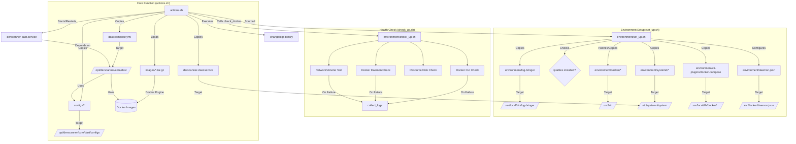
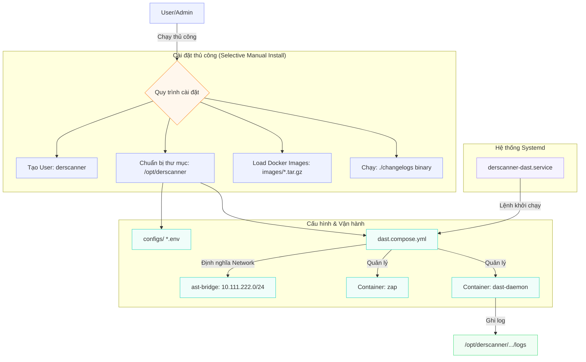

1. Sơ đồ liên kết các thành phần


Chi tiết các mối liên kết:

   1. Luồng thực thi chính (actions.sh):
       * Giai đoạn 1: Chuẩn bị môi trường: Gọi set_up.sh để cài đặt Docker binaries (/usr/bin/), cấu hình Docker daemon, và cài đặt plugin docker-compose. Nó cũng cài đặt công cụ log-bringer.
       * Giai đoạn 2: Kiểm tra Docker: Gọi check_up.sh để đảm bảo Docker hoạt động tốt (CLI, Daemon, khả năng tạo Network/Volume).
       * Giai đoạn 3: Cài đặt Core:
           * Tạo user derscanner.
           * Đưa các cấu hình từ configs/ và file dast.compose.yml vào thư mục vận hành /opt/derscanner/core/dast/.
           * Nạp các Docker images (zap và dast-daemon) từ thư mục images/ vào hệ thống.
           * Đăng ký dịch vụ derscanner-dast.service với systemd.
       * Giai đoạn 4: Cập nhật & Kích hoạt: Chạy binary changelogs để áp dụng các thay đổi cuối cùng và khởi động dịch vụ.

   2. Mối quan hệ dịch vụ:
       * derscanner-dast.service: Là "nhạc trưởng" điều khiển Docker Compose. Nó trỏ vào thư mục /opt/derscanner/core/dast và sử dụng lệnh docker compose up để khởi chạy hai container: zap và dast-daemon.
       * dast.compose.yml: Định nghĩa cấu trúc mạng (ast-bridge), volume và các file môi trường (.env) mà các dịch vụ cần sử dụng.

   3. Dữ liệu và Cấu hình:
       * Toàn bộ log vận hành của daemon được lưu tại: /opt/derscanner/core/dast/services/dast-daemon/logs.
       * Các cấu hình nhạy cảm nằm trong configs/zap.env và configs/dast-daemon.env.

2.  Quy trình cài đặt


 Chi tiết các mối liên kết:
   * Dịch vụ (Systemd) & Docker Compose: File derscanner-dast.service điều khiển lệnh docker compose -f dast.compose.yml up. Nó đảm bảo DAST luôn khởi động cùng hệ thống.
   * Mạng (Network): File dast.compose.yml tạo ra một mạng bridge riêng biệt (ast-bridge) với dải IP 10.111.222.0/24. Các container bên trong nói chuyện với nhau qua tên service (ví dụ: zap, artemis).
   * Dữ liệu (Persistence): Các file .env trong thư mục configs/ chứa biến môi trường. Thư mục logs/ được bind-mount từ host vào container để dễ dàng theo dõi.

3. Hướng dẫn Cài đặt Thủ công (Selective)

  Sử dụng phương pháp này khi VM của bạn đã có sẵn Docker để tránh bị script của hãng ghi đè cấu hình hệ thống.

```bash
    1 # 1. Tạo user và cấu trúc thư mục
    2 sudo useradd -U -m -d /opt/derscanner -s /bin/bash derscanner || true
    3 sudo mkdir -p /opt/derscanner/core/dast/services/dast-daemon/logs
    4 sudo mkdir -p /var/log/derscanner
    5
    6 # 2. Copy cấu hình (Đứng tại thư mục bundle)
    7 sudo cp -rf configs/ /opt/derscanner/core/dast/
    8 sudo cp -f dast.compose.yml /opt/derscanner/core/dast/
    9 sudo cp -f derscanner-dast.service /etc/systemd/system/
   10 sudo chown -R derscanner:derscanner /opt/derscanner /var/log/derscanner
   11
   12 # 3. Nạp Docker Images
   13 docker load -i images/daemon/derscanner-dast-daemon-12.1.tar.gz
   14 docker load -i images/zap/derscanner-zap-12.1.tar.gz
   15
   16 # 4. Chạy khởi tạo database/môi trường
   17 sudo chmod +x ./changelogs
   18 sudo ./changelogs "derscanner" "/opt/derscanner"
   19
   20 # 5. Khởi chạy
   21 sudo systemctl daemon-reload
   22 sudo systemctl enable --now derscanner-dast.service
```

4. Hướng dẫn Gỡ bỏ (Uninstall)

  Để xóa sạch hoàn toàn dấu vết của DerScanner DAST, hãy thực hiện các lệnh sau:
```bash
    1 # 1. Dừng và xóa dịch vụ
    2 sudo systemctl stop derscanner-dast.service
    3 sudo systemctl disable derscanner-dast.service
    4 sudo rm -f /etc/systemd/system/derscanner-dast.service
    5 sudo systemctl daemon-reload
    6
    7 # 2. Xóa Container, Network và Volume của DAST
    8 cd /opt/derscanner/core/dast
    9 sudo docker compose -f dast.compose.yml down -v --rmi all
   10
   11 # 3. Xóa các Docker Images (nếu bước trên chưa xóa hết)
   12 docker rmi derscanner-dast-daemon:12.1 derscanner-zap:12.1
   13
   14 # 4. Xóa User và Thư mục dữ liệu
   15 sudo userdel -r derscanner
   16 sudo rm -rf /opt/derscanner
   17 sudo rm -rf /var/log/derscanner
   18 sudo rm -f /tmp/derscanner_dast.log
```

5. Giải thích các script của hãng
A. actions.sh (The Orchestrator - Kịch bản điều phối)
  Đây là file thực thi chính. Nó quản lý luồng cài đặt từ đầu đến cuối.

   * Ghi log song song:

   1     exec 1> >(tee -a ${LOG_PATH}) 2> >(tee -a ${LOG_PATH} >&2)
       * Giải thích: Lệnh này chuyển hướng toàn bộ kết quả (stdout - 1) và lỗi (stderr - 2) vào file /tmp/derscanner_dast.log, đồng thời vẫn hiển thị ra màn hình. Giúp việc debug sau này rất dễ dàng.
   * Quản lý User hệ thống:

   1     [[ ! $(grep -w "derscanner:" /etc/passwd) ]] && useradd -U -m -d /opt/derscanner ...
       * Giải thích: Nó kiểm tra xem user derscanner đã tồn tại trong file /etc/passwd chưa trước khi tạo. Tham số -U tạo một group cùng tên, -m tạo thư mục home tại /opt/derscanner.
   * Tự động nạp Images:

   1     env ls images/*.tar.gz | xargs --no-run-if-empty -L 1 docker load -i
       * Giải thích: Tìm tất cả file nén trong thư mục images/ và đẩy vào lệnh docker load. xargs -L 1 đảm bảo nạp từng file một, tránh làm quá tải RAM.
   * Đăng ký dịch vụ với Systemd:

   1     systemctl daemon-reload && systemctl enable derscanner-dast.service
       * Giải thích: daemon-reload buộc Linux phải đọc lại các file cấu hình mới trong /etc/systemd/system/. enable cho phép dịch vụ tự khởi động cùng máy chủ.

  ---

  B. environment/set_up.sh (The Provisioner - Thiết lập hạ tầng)
  Đây là script "xâm lấn" nhất vì nó can thiệp vào cấu hình Docker của hệ thống.

   * Kiểm tra tính toàn vẹn (Integrity Check):

   1     expected_hash=$(sha256sum environment/docker/docker | cut -d " " -f1)
   2     current_hash=$(sha256sum /usr/bin/docker | cut -d " " -f1)
       * Giải thích: Nó so sánh mã băm (checksum) của file Docker đang có trên máy với file Docker đi kèm trong bundle. Nếu khác nhau, nó coi như môi trường chưa chuẩn và sẽ tiến hành ghi đè.
   * Thay đổi IP gốc của Docker:

   1     "bip": "10.111.221.1/24" (trong file daemon.json)
       * Giải thích: bip là Bridge IP. Nó thay đổi địa chỉ IP của card mạng ảo docker0. Đây là lý do tại sao nó yêu cầu VM trắng, vì thay đổi này có thể làm đứt kết nối của các container đang chạy.
   * Dừng hàng loạt dịch vụ:

   1     toggle_ast_units(){
   2       units=$(systemctl list-unit-files --type=service | grep -oE "derscanner[^.]+")
   3       ... systemctl "${1}" "${unit}"
   4     }
       * Giải thích: Hàm này tìm tất cả các service bắt đầu bằng chữ "derscanner" và dừng chúng lại. Điều này giúp quá trình ghi đè binaries diễn ra suôn sẻ mà không bị lỗi "file busy".

  ---

  C. environment/check_up.sh (The Validator - Kiểm tra điều kiện)
  Script này đóng vai trò "Kỹ sư kiểm định" để đảm bảo hạ tầng đủ sức chạy DAST.

   * Kiểm tra tài nguyên (Hard Requirement):

   1     AVAILABLE_SPACE=$(df --output=avail --human-readable /opt | tail -n1)
   2     MIN_SPACE=128
       * Giải thích: Nó kiểm tra dung lượng trống tại phân vùng /opt. DAST cần ít nhất 128GB vì khi quét lỗ hổng, nó tạo ra lượng log cực lớn và lưu trữ rất nhiều trạng thái (state) của các cuộc tấn công giả lập.
   * Kiểm tra quyền hạn Kernel (Network/Volume Test):

   1     docker network create "${NETWORK_NAME}" && docker network rm "${NETWORK_NAME}"
       * Giải thích: Không chỉ kiểm tra xem Docker có chạy không, nó còn thử tạo thử một Network và Volume thực sự. Điều này để xác nhận Docker có quyền can thiệp vào tầng Kernel (IPtables, Bridge, File System) hay không.
   * Thu thập log lỗi (Failure Debugging):

   1     collect_logs(){
   2       journalctl --since=$(date +%F) --unit docker.service >> /tmp/docker.log
   3     }
       * Giải thích: Nếu bất kỳ bước kiểm tra nào thất bại, nó sẽ tự động trích xuất log hệ thống từ journalctl để người dùng có cái nhìn chi tiết về nguyên nhân (ví dụ: lỗi do thiếu RAM, lỗi do Firewall chặn...).
